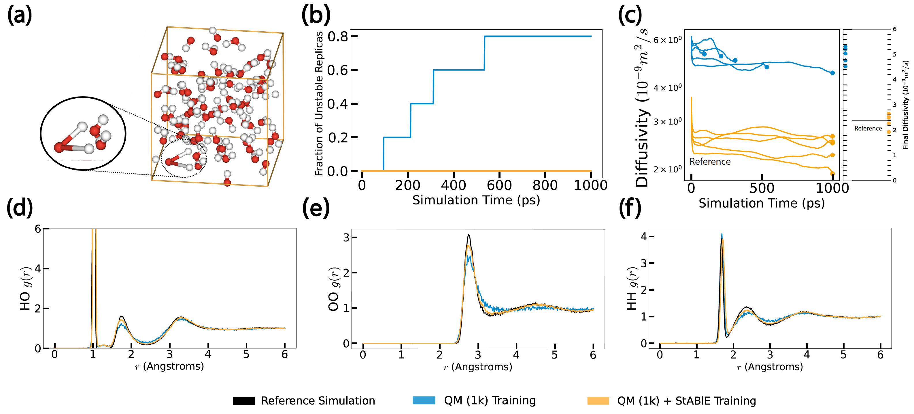

# [TMLR 2025] Stability-Aware Training of Machine Learning Force Fields with Differentiable Boltzmann Estimators
<p align="center">
<a href="https://arxiv.org/abs/2402.13984"></a>
<!-- <a href="https://www.youtube.com/watch?v=hCVXXdJZJFo"></a> -->
<a href="https://www.youtube.com/watch?v=hCVXXdJZJFo">
    
</a>
</p>

We introduce **Stability-Aware Boltzmann Estimator (StABlE) Training** for Machine Learning Force Fields (MLFFs), which enables refinement of MLFFs using system observables (obtained via high-fidelity simulation or experiment) to improve their stability in long molecular dynamics (MD) simulations. Our method enables MD simulations that are stable for over 10x longer than those produced by unrefined MLFF, eliminating unphysical events such as non-reactive bond breaking and atomic collisions, and significantly improves the accuracy of estimated simulation observables, such as radial distribution functions and diffusivity coefficients.

<p align="center">

</p>
<p align="center">
<i>StABlE Training of a NequIP force field on the Ac-Ala3-NHMe tetrapeptide eliminates unphysical bond stretching events.</i>
</p>

<p align="center">

</p>
<p align="center">
<i>StABlE Training of a GemNet-T force field on an all-atom water system yields simulations stable for > 1 ns, and significantly improved estimation of diffusivity coefficients and element-conditioned RDFs.</i>
</p>


We borrow some infrastructure code from the [MDsim](https://github.com/kyonofx/MDsim) codebase which accompanied the [Forces are Not Enough](https://arxiv.org/abs/2210.07237) paper (which is in turn based upon the [FAIR-Chem](https://github.com/FAIR-Chem/fairchem) repo from the Open Catalyst team at Meta). To a lesser extent, we also build upon the [TorchMD](https://github.com/torchmd/mdgrad) and [Neural Force Field](https://github.com/learningmatter-mit/NeuralForceField) codebases. 

## Environment Setup
- Install the environment via ```mamba env create -f env.yml```. You can also use conda but mamba is much faster.
- Run ```pip install -e ./``` to install ```mdsim``` as a package.

## Download Data
- Run ```python download_data.py``` to download all required data for the systems considered in the paper (aspirin from [MD17](http://www.sgdml.org/#datasets), ac-Ala3-NHMe from [MD22](http://www.sgdml.org/#datasets), and Water from [Forces are Not Enough](https://arxiv.org/abs/2210.07237)). This may take 10-15 minutes. If you want to download other molecules (e.g benzene from MD17) or dataset sizes, you can run the corresponding system-specific file, e.g ```python data/md17.py --molecule benzene --size 50k```. Adding the ```--contiguous``` flag preserves time ordering (required to compute dynamical observables during StABlE Training).

## Quantum Mechanical Energy/Forces Pretraining
We have provided checkpoints for all of the pretrained models in ```qm_pretrained_checkpoints/```. However, you can also train the models from scratch. Model checkpoints will be placed in ```./MODELPATH```. Logging is done via Weights and Biases (wandb).
- ```pretraining.py```: Top-level script for traditional energy/forces QM training of MLFFs. This should be run to convergence prior to StABlE Training. 
- To train a SchNet model on aspirin 1k, run ```python pretraining.py --mode train --config-yml configs/pretraining/md17/schnet.yml --molecule aspirin --size 1k```. 
- To train a Nequip model on ac-Ala3-NHMe 1k, run ```python pretraining.py --mode train --config-yml configs/pretraining/md22/nequip/ac_Ala3_NHMe.yml --molecule ac_Ala3_NHMe --size 1k --nequip```. 
- To train a GemNet-T model on Water 1k, run ```python pretraining.py --mode train --config-yml configs/pretraining/water/gemnet-T.yml --size 1k```. 

## StABlE Training
```stable_training.py``` is the top-level script for running the StABlE algorithm to finetune the pretrained models. For logging the progress of training and evaluation, we use tensorboard: ```tensorboard --logdir [RESULTS_DIRECTORY]```.

- To finetune a SchNet model pretrained on aspirin, run ```python stable_training.py --config-yml configs/stable_training/md17/train.yml```.
- To finetune the NequIP model pretrained on Ac-Ala3-NHMe, run ```python stable_training.py --config-yml configs/stable_training/md22/train.yml```. 
- For the GemNet-T model pretrained on water, run ```python stable_training.py --config-yml configs/stable_training/water/train.yml```. 
- We have also provided the StABlE-trained checkpoints for each model/system in ```paper_stable_training_results/``` so that you can directly run the evaluation scripts (see next).

## Evaluation
- To evaluate the final performance of the StABlE-trained model in MD simulations, run the same scripts with the ```simulate.yml``` config. For example, ```python stable_training.py --config-yml configs/stable_training/md17/simulate.yml --eval_model [EVAL_MODEL]```.
  - The ```--eval_model``` flag specifies which checkpoint from StABlE Training to use for evaluation. Setting it to ```"pre"``` uses the QM-pretrained checkpoint (i.e before StABlE Training). Setting to a value of ```"10k"``` or       ```"50k"``` will load the QM-pretrained checkpoint on the 10k or 50k dataset respectively. Setting it to ```"post"``` uses the final checkpoint from StABlE Training. You can also set it to a value of ```"post_cycle[i]_epoch[j]"```, in which case the checkpoint from the jth epoch from the ith cycle of StABlE Training will be used. Setting to ```"post_cycle[i]"``` will load the checkpoint of the final epoch in cycle i. In the simulation configs, ```eval_model``` is by default set to the values used in the paper. We recommend using these same values when you do evaluation of your own training runs.
- At the conclusion of evaluation, a file called ```final_metrics.json``` will be written to the ```log_dir``` specified in the config file, containing metrics relating to stability and observable accuracy of the simulation. ```.npy``` files containing the calculated observables (RDF, ADF, VACF, diffusivity, etc.) for each replica are also saved to the same directory.
- By default, the evaluation scripts will use the pretrained checkpoints in ```paper_stable_training_results/```. To use models you have trained yourself, change the ```results_dir``` argument in the simulation config.

## Citation
If you use this code in your research, please cite our paper.

```bibtex
@misc{raja2024stabilityawaretrainingmachinelearning,
      title={Stability-Aware Training of Machine Learning Force Fields with Differentiable Boltzmann Estimators}, 
      author={Sanjeev Raja and Ishan Amin and Fabian Pedregosa and Aditi S. Krishnapriyan},
      year={2024},
      eprint={2402.13984},
      archivePrefix={arXiv},
      primaryClass={cs.LG},
      url={https://arxiv.org/abs/2402.13984}, 
}
